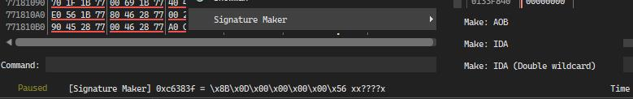

# x64dbg Signature Maker

An [x64dbg](https://x64dbg.com/#start) plugin to generate unique signatures in different styles. 

[[Download](https://github.com/u16rogue/x64dbg-sigmaker/releases)]

## Supported styles
* AOB - Array of bytes plus mask (`\xE9\x00\x00\x00\x00 x????`)
* IDA - IDA style signature (`E9 ? ? ? ?`)
* IDA2 - IDA style signature but wildcards use 2 wildcard `?` (`E9 ?? ?? ?? ??`)

## Libraries
* [distorm](https://github.com/gdabah/distorm)

## License
[GNU General Public License 3.0](https://www.gnu.org/licenses/gpl-3.0.en.html)